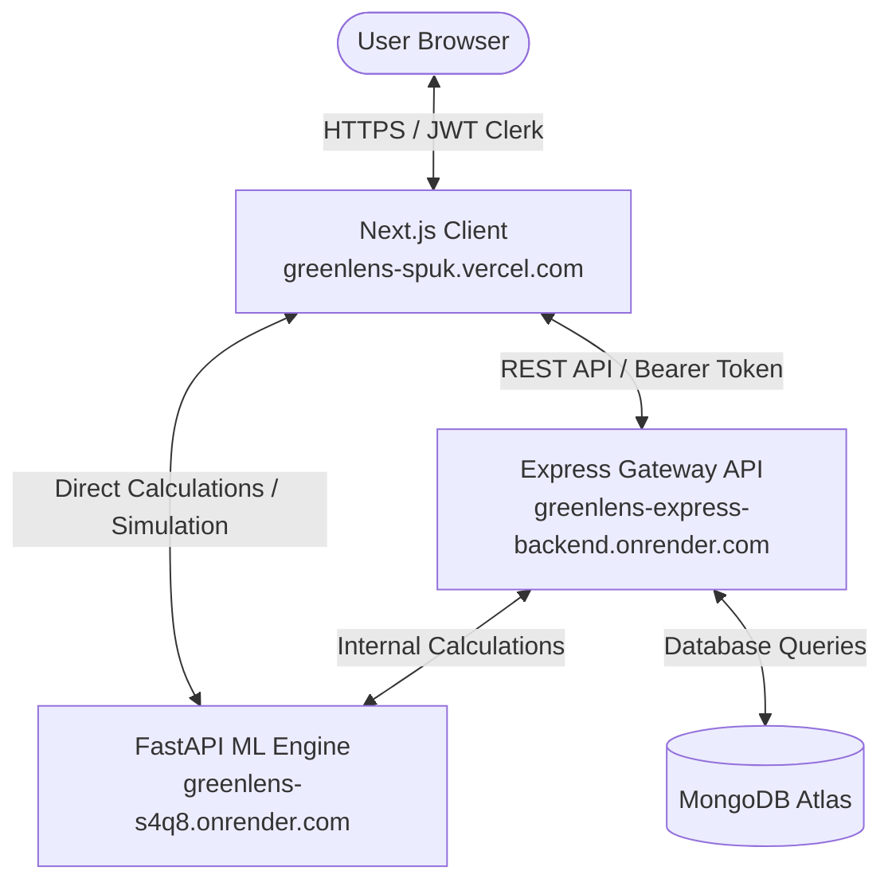

#  GreenLens – End-to-End System Documentation

Welcome to the technical documentation for **GreenLens**—a modular, smart sustainability platform that helps users track, verify, and offset their carbon footprint. Users earn **Green Tokens** for verified eco-friendly actions like energy saving and low-carbon travel.

---

## System Architecture

GreenLens is built on a multi-tier microservice layout:
1. **Frontend App**: Next.js (React + TailwindCSS + Framer Motion) client hosted at `https://greenlens-spuk.vercel.com`.
2. **Gateway Backend API**: Node.js & Express server handling Clerk authentications, database management, and microservice orchestration, hosted at `https://greenlens-express-backend.onrender.com`.
3. **AI/ML Engine**: Python FastAPI microservice calculating carbon offsets, simulating models, and parsing utility bills, hosted at `https://greenlens-s4q8.onrender.com`.



---

## Microservices & Deployments

### 1. Next.js Frontend (Vercel)
* **Live URL**: `https://greenlens-spuk.vercel.com`
* **Directory**: `/frontend-temp`
* **Port (Local)**: `http://localhost:3000`

### 2. Express Gateway API (Render)
* **Live URL**: `https://greenlens-express-backend.onrender.com`
* **Directory**: `/Backend`
* **Port (Local)**: `http://localhost:8080` (Express Entry point at `src/index.js`)

### 3. AI/ML FastAPI Engine (Render)
* **Live URL**: `https://greenlens-s4q8.onrender.com`
* **Directory**: `/Backend`
* **Port (Local)**: `http://localhost:8000` (FastAPI Entry point at `main.py`)

---

## Environment Configuration Guide

To configure development environments locally, configure the following `.env` configurations:

### Next.js Client Configuration (`frontend-temp/.env`)
```env
# Clerk Keys (Auth)
NEXT_PUBLIC_CLERK_PUBLISHABLE_KEY=your_clerk_publishable_key
CLERK_SECRET_KEY=your_clerk_secret_key
NEXT_PUBLIC_CLERK_SIGN_IN_URL=/auth
NEXT_PUBLIC_CLERK_SIGN_UP_URL=/auth

# Express Backend Gateway URL
NEXT_PUBLIC_API_URL=https://greenlens-express-backend.onrender.com/api/v1

# AI/ML FastAPI Engine URL (Simulations & Forms)
NEXT_PUBLIC_ML_API_URL=https://greenlens-s4q8.onrender.com
```

### Express Gateway Configuration (`Backend/.env`)
```env
# MongoDB Database URI
MONGODB_URI=mongodb+srv://<username>:<password>@<cluster>.mongodb.net/<dbname>?retryWrites=true&w=majority
PORT=8080

# CORS Allowed Origin
CORS_ORIGIN=https://greenlens-spuk.vercel.com

# AI/ML FastAPI Service URL
ML_API_URL=https://greenlens-s4q8.onrender.com

# Clerk Secret Key
CLERK_SECRET_KEY=your_clerk_secret_key

# Cloudinary Storage Integrations
CLOUDINARY_CLOUD_NAME=your_cloudinary_cloud_name
CLOUDINARY_API_KEY=your_cloudinary_api_key
CLOUDINARY_API_SECRET=your_cloudinary_api_secret
```

---

## Database Schema & Models

Data models are defined in [models.js](file:///Users/saptarshiupadhyay/Green-Lens/Backend/src/models/models.js):

### 1. `User` Schema
Tracks demographic and core carbon footprints:
* `clerkId` (`String`, required, unique): Unique account key from Clerk authentication node.
* `email` (`String`, required, unique): User contact email.
* `fullName` (`String`, required): User full name.
* `avatarUrl` (`String`): User profile image path.
* `adhaar` (`String`, unique, sparse): Aadhaar number (KYC validation).
* `addressId` (`ObjectId` ref `Address`): Pointer to the user's primary address.
* `greenTokens` (`Number`, default `0`): Local balance of green tokens.
* `badges` (`Array[String]`): Unlocked gamification levels.
* `trustLvl` (`Number`, default `0`, range `0-100`): Credibility level based on verification history.
* `carbonFootprint` (`Number`, default `0`): Calculated carbon footprint (in kg CO2).

### 2. `Address` Schema
Underpins calculations for structural housing baselines:
* `address` (`String`, required): Residence location.
* `city` (`String`, required): City of residence.
* `state` (`String`, required): State of residence.
* `pinCode` (`String`, required): Pin code.
* `carpetArea` (`String`): Carpet area in sq. ft.
* `homeType` (`String`, enum: `House`, `Apartment`, `Bungalow`, `Other`): Building structure type.
* `tenure` (`String`, enum: `Owned`, `Rented`): Renting status.

### 3. `ElectricityUsage` Schema
Tracks logged electricity records:
* `userID` (`ObjectId` ref `User`, required): Owning account.
* `bill` (`Number`): Bill identifier or index.
* `month` (`String`): Calendar month.
* `unitsUsed` (`Number`, required): Total grid usage in kWh.
* `solarUsed` (`Number`, default `0`): Direct off-grid offset.

### 4. `Vehicle` Schema
* `userID` (`ObjectId` ref `User`, required): Owning account.
* `isEV` (`Boolean`, required): True if electric.
* `batteryCapacity` (`Number`): Battery capacity.
* `modelName` (`String`): Vehicle model description.
* `type` (`String`, enum: `Car`, `Scooter`, `Motorcycle`, `E-Bike`, `Bicycle`, `Three-Wheeler`, `Other`): Class category.
* `vehicleNumber` (`String`): License plate number (used to prevent duplicate inputs).

### 5. `VehicleRun` Schema
Manages monthly vehicle odometer updates and logs:
* `vehicleID` (`ObjectId` ref `Vehicle`, required): Referenced vehicle.
* `lastOdometer` (`Number`): Last recorded odometer value.
* `currentMonthKMCover` (`Number`): Distance traveled during the current cycle.
* `currentMonthStartDate` (`Date`): Timestamp tracking month cycles.
* `totalKMCovered` (`Number`): Lifetime travel distance.

### 6. `Forestation` Schema
Tracks user's tree-planting logs:
* `userID` (`ObjectId` ref `User`, required): Owning user.
* `totalPlants` (`Number`): Cumulative plants planted.
* `lastPic` (`String`): URL of verification photo.
* `lastLocation` (`String`): Location address.
* `lastSpecies` (`Array[String]`): List of tree species.

---

## ⚡ Core API Routing Reference

Authentication middleware validates Clerk's JWT bearer token under `Authorization: Bearer <token>`.

### Gateway Routes (`/api/v1`)

#### User Routes (`/users`)
* `GET /dashboard`: Gathers profile details, lifetime token metrics, current month's electricity units, vehicle runs, and active badges.
* `POST /sync`: Synchronizes user info from Clerk to MongoDB. Creates a default address and awards a starting balance of `100` green tokens.
* `PATCH /profile`: Updates user address details, Aadhaar number, and demographics.
* `POST /redeem`: Deducts tokens from user profile to redeem marketplace items.

#### Activity Submission Routes (`/form`)
* `POST /electricity`: Logs electricity usage. Checks `homeType` and `carpetArea` features from the user profile, invokes the Python ML service, updates carbon footprint caches, and awards green tokens.
* `POST /solar`: Logs solar panel installation data with proof upload support.
* `POST /transport`: Coordinates travel forms. Handles public transit and personal vehicles.
  * **Public Transit / Cycle**: Estimates carbon offsets and updates tokens.
  * **Personal Vehicle**: Registers new vehicles or updates existing odometer counts (verifies that updates are higher than the previous log).
* `POST /plantation`: Validates plant counts, location, and species list. Processes proof picture uploads via **Cloudinary**, and increments `greenTokens` by `10` tokens per tree.
* `POST /purchase`: Logs green purchases.

#### Marketplace Routes (`/store`)
* `POST /redeem`: Validates product availability against user token balances. Product codes include:
  * `VOUCHER_500` (Cost: `500` tokens)
  * `MERCH_TEE` (Cost: `2000` tokens)
  * `DONATE_100` (Cost: `100` tokens)

---

## Python FastAPI Engine Routes (`main.py`)

* **`POST /parse-bill`**: Extracts invoice data from files (PDF/Image format) via OCR and regular expressions (Regex patterns look for Customer ID, Carpet Area, and Units Used).
* **`POST /calculate-electricity`**: Implements electricity carbon algorithms. Uses a local machine learning regression model (`electricity_benchmark_model.pkl`) to predict expected carbon footprint based on carpet area and housing type, then rewards users if their grid consumption is below the ML expected benchmark.
* **`POST /calculate-travel`**: Calculates travel emission metrics. Employs factors based on vehicle types:
  * `Car` (0.248 kg CO2/km)
  * `Motorcycle` / `Scooter` (0.114 kg CO2/km)
  * `E-Bike` (0.077 kg CO2/km)
  * `Bicycle` (0.000 kg CO2/km)
  * Comparing travel distances against a baseline of `150` kg CO2 to calculate token awards.

---

## Step-by-Step Feature Workflows

### 1. Login & Clerk Synchronisation Workflow
1. User authenticates on Vercel (`/auth`) via Clerk's widget interface.
2. The browser captures Clerk's JWT bearer token and sends it to Express.
3. Express matches the token sub-claim ID (`req.auth.userId`). If the user does not exist in the database, it creates a profile, registers a linked Address, and allocates a starting balance of `100` green tokens.

### 2. Odometer Logging & Commute Calculations
1. The user logs their commute distance in the transport form.
2. If the user logs public transit or cycling:
   - The frontend requests travel calculation endpoints directly.
   - The backend records trip parameters, updates local token balances, and registers carbon offsets.
3. If the user registers a personal vehicle:
   - The backend queries the database for matching vehicle numbers.
   - If new, the vehicle model and initial odometer values are saved (no tokens awarded).
   - If existing, the backend validates that the new odometer reading is higher than the previous one, calculates the distance covered, calls the ML service to determine carbon savings against the baseline, and awards green tokens.

### 3. Green Tokens Minting & Redeem
1. When users earn tokens, the database balance increments.
2. When users redeem items from the store:
   - Express validates the token balance against the item cost.
   - If valid, the database balance is updated, and the redeemed item is generated.
